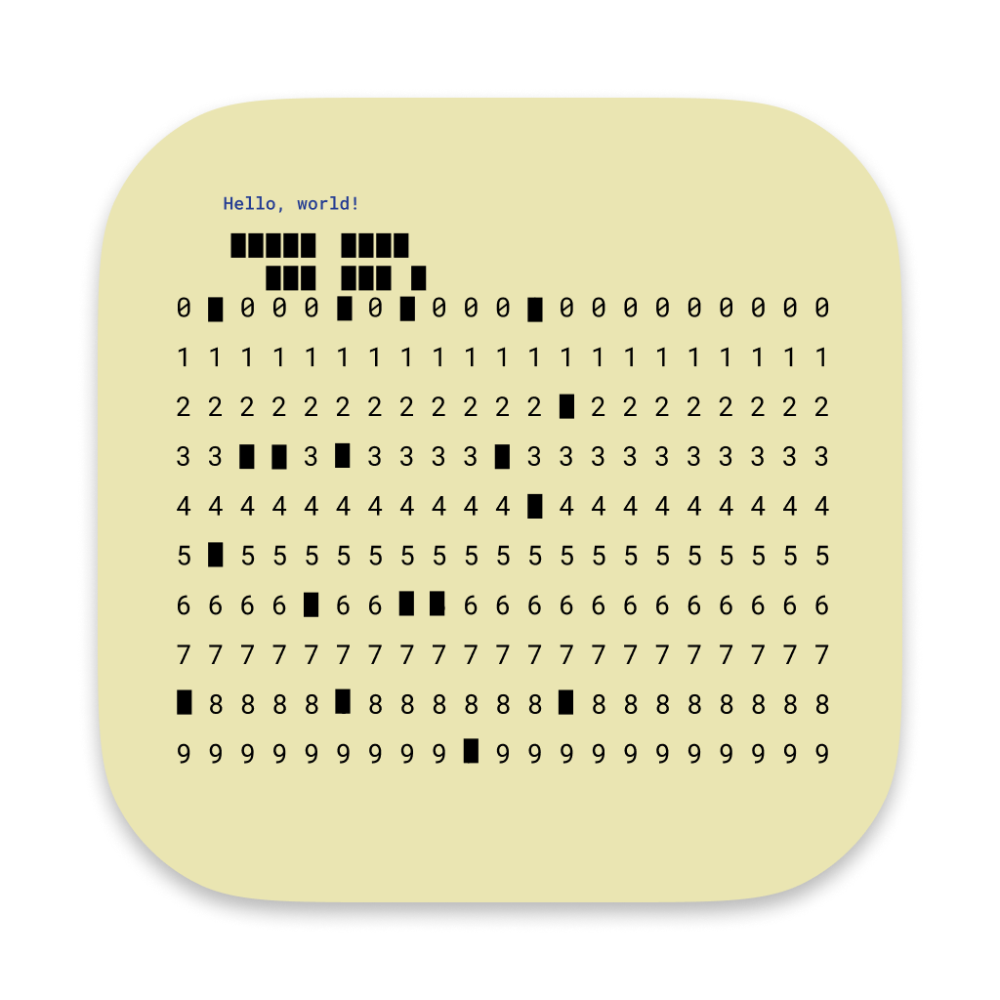

# Suggestions

Currently in Beta.

An app that allows you to get code suggestions everywhere. It currently supports [CodeMenu](https://extiri.com/codemenu.html) snippets manager.

## Support for editors

At this moment Suggestions works properly on all editors that follow similar accessibility behaviour (AXRole is AXTextArea, text is in AXValue and cursor position is in AXInsertionPointLineNumber) to Xcode. This means that native apps will usually work correctly. Support for other editors is planned.

IDEs fully working:

- Xcode
- JetBrains IDEs (tested on IntelliJ IDEA 2024.1.2 and RustRover 2024.1)

IDEs working, but with issues:
- Visual Studio Code (part of the query still remains after pasting)

IDEs not working:
- Zed

If you find an issue with some editor or want to report whether it's supported, feel free to file an issue with editor's name and webpage.

## Sources

Suggestions is supposed to be an universal app for access to data directly from editors. It currently only supports CodeMenu. In the future a provider system will be added which will help in adding support for other sources.

## Download

You can download the prebuilt binary from releases [here](https://github.com/Extiri/Suggestions/releases/latest).

## Help

- How to make suggestions appear?

All you have to do is enter §§ signs on the line where you want to show suggestions, then a suggestions window will appear. You enter query after §§ signs. Suggestions window will update automatically.
      
- How to select and choose suggestions?

In suggestions window, you can move upwards using ⌥ (Option) + [ key combination and downwards using ⌥ (Option) + ]. You choose snippet to enter using ⌥ (Option) + v. If snippet contains placeholders, query will be replaced with a special placeholder query which denotes placeholders using @name=#\"\"# pattern. Fill values between #\" and \"# next to proper placeholder name and then use  ⌥ (Option) + v keyboard shortcut again.
      
- How to use abbreviations?

You can use abbreviations by first setting an abbreviation for a snippet in CodeMenu and then accessing it by entering § anywhere and then the abbreviation. Code will appear automatically.
